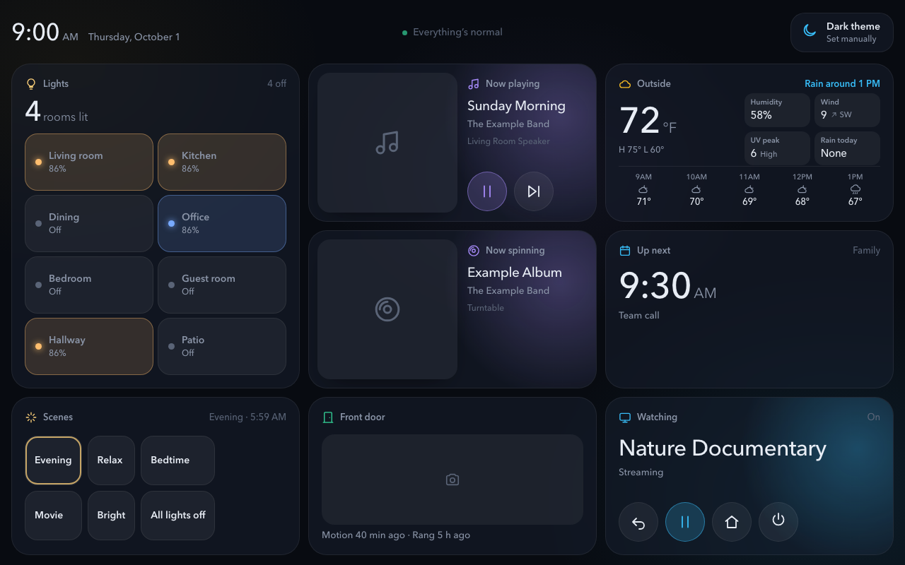
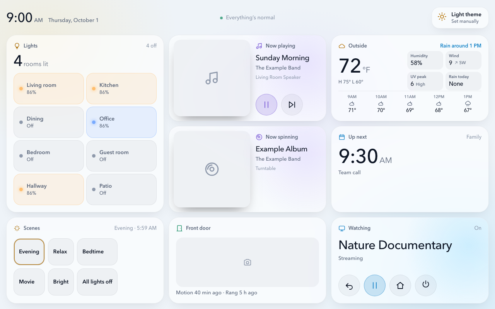
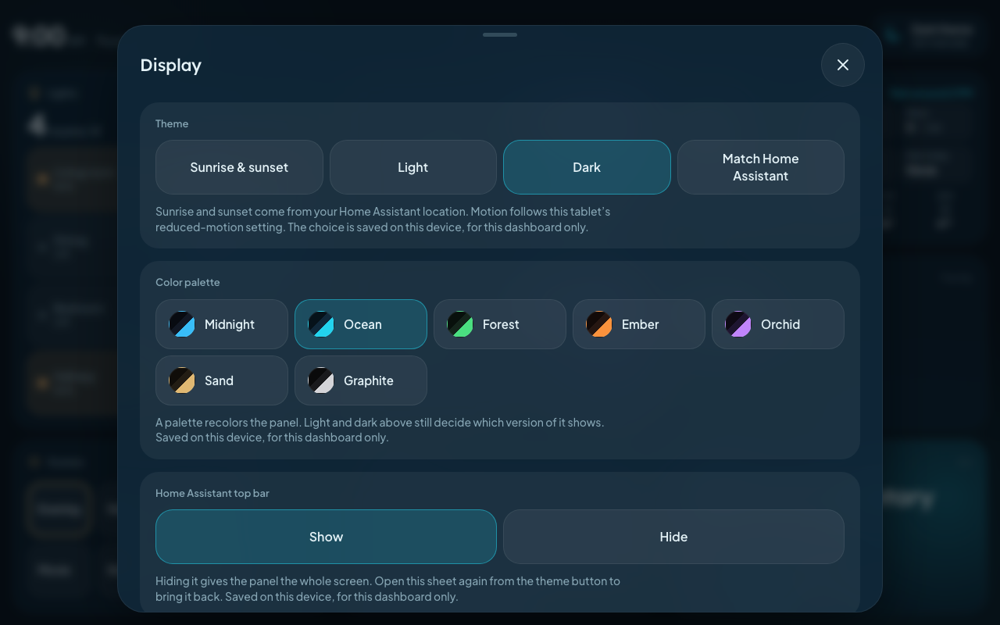
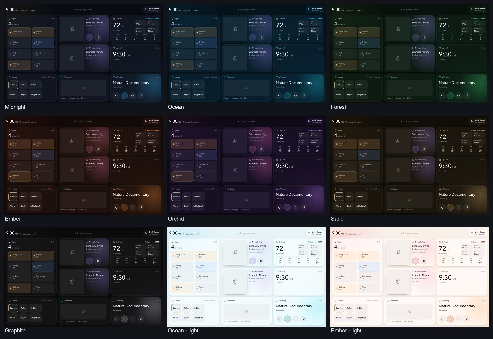

# Hearth Panel

BASED ON THE AMAZING WORK HERE ... just made a few tweaks. Feel free to use but please thank the creator.

https://claude.ai/artifact/5picA98JhWVQYbHHYmwCoo

A full-screen dashboard card for Home Assistant, built for wall-mounted tablets. One screen of large, glanceable cards (lights, music, weather, calendar, scenes, front door) with detail sheets that open on tap. It follows the sun between a light and a dark look, and comes with seven colour palettes.

- **Touch first.** Big targets, second-tap confirmation for risky actions (all lights off, goodnight).
- **Themes and palettes.** Automatic light/dark at sunrise and sunset, or fixed, or follow Home Assistant. Midnight, Ocean, Forest, Ember, Orchid, Sand and Graphite palettes, each with a light and a dark version.
- **Per-dashboard settings.** Theme, palette and "hide the Home Assistant top bar" are remembered separately for each dashboard on each device, so a bedroom tablet and a hallway tablet can look different.
- **Night mode.** Optionally dim the screen to a quiet clock after sunset until someone taps it.
- **No dependencies.** One JavaScript file. Nothing is sent anywhere except the fonts (see Privacy).



<p>
  
  
</p>



_Screenshots are the demo page with made-up data._

## Try it without Home Assistant

The demo page runs the card with made-up data:

```bash
python3 -m http.server 8000
# then open http://localhost:8000/demo/
```

## Install

### With HACS (recommended)

1. In HACS, open the menu, choose **Custom repositories**, and add `https://github.com/seanbaugh/seans-hearth-home-assistant-panel` as type **Dashboard** (called "Lovelace" in older versions).
2. Install **Hearth Panel**, then reload the browser.
3. HACS adds the resource for you. If it does not, add `/hacsfiles/seans-hearth-home-assistant-panel/hearth-panel.js` as a **JavaScript module** under *Settings → Dashboards → ⋮ → Resources*.

### Manually

1. Copy `hearth-panel.js` to `/config/www/` on your Home Assistant.
2. Under *Settings → Dashboards → ⋮ → Resources*, add `/local/hearth-panel.js` as a **JavaScript module**. (Turn on *Advanced mode* in your user profile if you do not see Resources.)
3. Reload the browser.

## Use it

Create a dashboard view with **View type: Panel** and add one card in YAML:

```yaml
type: custom:hearth-panel
rooms:
  - { entity: light.living_room, name: Living room }
  - { entity: light.kitchen, name: Kitchen }
scenes:
  - { entity: scene.evening, name: Evening }
  - { entity: script.bedtime, name: Bedtime, confirm: true }
```

Complete examples are in [`examples/`](examples/): a landscape wall tablet and a bedside tablet. Replace every entity with your own.

Nothing is preconfigured: with an empty config the card shows what to add. Media players and the weather entity are found automatically.

## Options

| Option | What it does |
| --- | --- |
| `board` | Which cards to show and in what order. Names: `rooms`, `media`, `weather`, `agenda`, `scenes`, `door`, `vinyl`, `tv`, `climate`, `good`. Use `{ card: rooms, tall: true }` to make one card two rows high. Default: `rooms, media, weather, agenda, scenes`. |
| `rooms` | Lights or light groups: `{ entity, name, count }`. `count: false` leaves one out of the "lit" total. Tap a tile to toggle, press and hold for colour and per-light controls. |
| `rooms_unit` | Words after the big number, default `[room lit, rooms lit]`. |
| `scenes` | Scenes or scripts: `{ entity, name, confirm }`. `confirm: true` needs a second tap. |
| `media` | `auto` (every media player) or a list of entity IDs. `media_ignore` hides some. |
| `weather` | A weather entity, or `auto` (the default) for the first one found. |
| `calendars` | List of calendar entities. `agenda_mode: tomorrow` shows tomorrow's first event (a bedtime view). |
| `camera`, `doorbell`, `motion`, `motion_switch`, `doorbell_battery` | Front-door card. `doorbell` and `motion` are `event` entities. |
| `recent_minutes` | How long a ring or motion counts as "just now". Default 3. |
| `climate` | `{ humidity, temperature, fan: { up, down, power } }` for the `climate` card. Fan buttons call scenes. |
| `goodnight` | `{ entity, name, detail }` for the `good` card: a big second-tap button for a script or scene. |
| `night` | `{ mode: dim, wake_seconds: 45 }` shows only a dim clock after sunset until tapped. |
| `tv` | Optional remote: `{ name, room, player, remote, apps: [] }` for an Apple TV (media player plus remote entity). |
| `vinyl` | Optional "now spinning" card: `{ album, artist, cover }`, each an `input_text` entity that your own automation fills in. The card only reads them. |
| `alexa` | Optional text commands sent through the Alexa Devices integration: `{ name, device_id, actions: [{ name, icon, command, group }] }`. |

## Themes and palettes

Tap the sun/moon button at the top right to open **Display**:

- **Theme:** sunrise and sunset, always light, always dark, or match Home Assistant.
- **Color palette:** seven palettes. A palette recolours surfaces, text and the accent. Status colours (warnings, alerts) stay the same in every palette.
- **Home Assistant top bar:** hide it to give the panel the whole screen.

Choices are saved in the browser of the device you are using, separately for each dashboard.

## Privacy

The card makes no network requests of its own. It loads two fonts (Plus Jakarta Sans and Lexend) from Google Fonts, which means your browser contacts Google when the dashboard loads. To avoid that, host the fonts yourself and change `FONT_URL` at the top of `hearth-panel.js`.

## Development

There is no build step: edit `hearth-panel.js` and reload the demo page.

## License

MIT. See [LICENSE](LICENSE).
